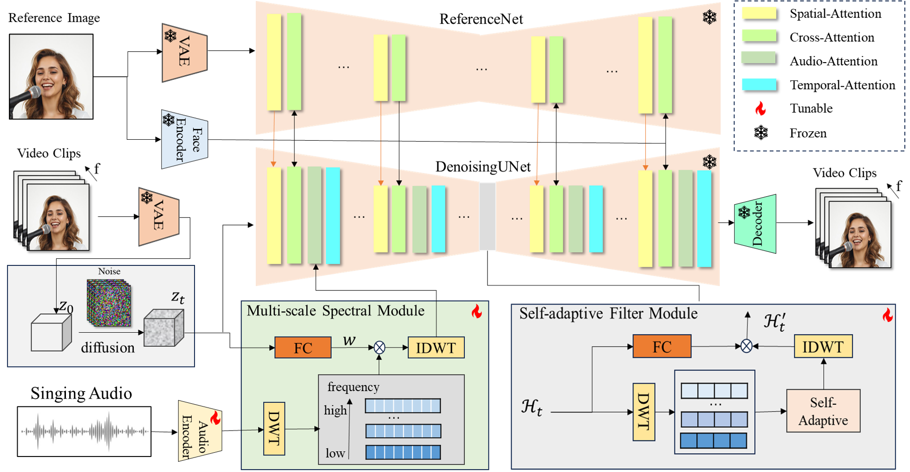

<h1> Source code: SINGER: Vivid Audio-driven Singing Video Generation with Multi-scale Spectral Diffusion Model</h1>


[](https://yl4467.github.io/)
[](https://arxiv.org/abs/2412.03430)
[](https://huggingface.co/yl2333/SINGER)
[](https://huggingface.co/yl2333/SINGER)

## Framework 
The framework of the proposed method.


## Showcases
<center>
    <video width="320" height="240" controls>
    <source src="assets/seeyouagain_001.mp4" type="video/mp4">
  </video>
  <video width="320" height="240" controls>
    <source src="assets/seeyouagain_002.mp4" type="video/mp4">
  </video>
  <video width="320" height="240" controls>
    <source src="assets/wseeyouagain_000.mp4" type="video/mp4">
  </video>
  <video width="320" height="240" controls>
    <source src="assets/wseeyouagain_001.mp4" type="video/mp4">
  </video>
</center>

## Usage of SINGER
### Environment
Create conda environment:

```bash
  conda create -n singer python=3.10
  conda activate singer
```

Then install the required packages with `pip`

```bash
  pip install -r requirements.txt
  pip install .
```

### Download the pretrained model
Download our pretrained model from [HuggingFace](https://huggingface.co/yl2333/SINGER) and change the corresponding model directory path `audio_ckpt_dir` in the `config/inference/inference.yaml`.

### Prepare audios and reference images
Prepare you own singing audios and the reference images and change the `--driving_audio` and `--source_image` into the right path. Make sure your singing audio is in the `.wav` format. You can also use our provided samples in `example` folder to test the perfromance.


### Run Inference
To run the test case of the proposed method, run the `scripts/inference.py`,  pass `source_image` and `driving_audio` as input:

```bash
python scripts/inference_new.py --config configs/inference/inference.yaml --source_image examples/0001.jpg --driving_audio examples/0001.wav --output results/
```
The generated videos will be saved in the `results` folder.

For more options:

```shell
usage: inference.py [-h] [-c CONFIG] [--source_image SOURCE_IMAGE] [--driving_audio DRIVING_AUDIO] [--output OUTPUT] [--pose_weight POSE_WEIGHT]
                    [--face_weight FACE_WEIGHT] [--lip_weight LIP_WEIGHT] [--face_expand_ratio FACE_EXPAND_RATIO]

options:
  -h, --help            show this help message and exit
  -c CONFIG, --config CONFIG
  --source_image SOURCE_IMAGE
                        source image
  --driving_audio DRIVING_AUDIO
                        driving audio
  --output OUTPUT       output video file name
  --pose_weight POSE_WEIGHT
                        weight of pose
  --face_weight FACE_WEIGHT
                        weight of face
  --lip_weight LIP_WEIGHT
                        weight of lip
  --face_expand_ratio FACE_EXPAND_RATIO
                        face region
```

## Crediets
Thanks to the [hallo](https://github.com/fudan-generative-vision/hallo), [WaveDiff](https://github.com/VinAIResearch/WaveDiff) and [FcaNet](https://github.com/cfzd/FcaNet) repositories,  for their open research and exploration.
